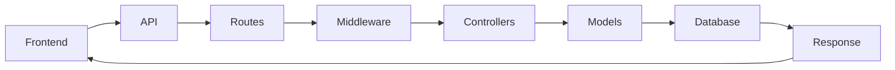

# EcoSync - Waste Management Application

Welcome to EcoSync, a Waste Management Application designed for Dhaka city. This project utilizes React for the frontend and Node.js for the backend, both located in the same root directory.

## Installation

To run the backend, navigate to the `server` directory:

```bash
cd server
npm install
npm start
# or
npm run dev
```

To run the frontend, navigate to the `client` directory:

```bash
cd client
npm install
npm run dev
```


## Database Management

To clean the database, run:

```bash
npm run clean:database
```

To seed the database, run:

```bash
npm run seed:database
```

## Environment Variables

Make sure to set up your `.env` file with the following variables:

```
MONGODB_URI=*your mongodb uri*
PORT=5000
JWT_SECRET=*your jwt secret
TOKEN_SECRET=*your token secret*
EMAIL=*your email*
PASSWORD=*your password*
```

## System admin Email & Password
Email : `admin@gmail.com`
Password : `password`

## About

EcoSync aims to streamline waste management processes in Dhaka city. It provides functionalities for efficient waste collection, tracking, and management.

For any inquiries, please contact team Endeavor at `teamendeavorcodesamurai@gmail.com`.

 
## 1. Diagrams and Flowcharts
### Entity Relationship Diagram


### 2. End to End Activity Diagram


### 3. Backend Flow Diagram
 ```mermaid
graph LR;
    Frontend_API --> Routes;
    Routes --> Middleware;
    Middleware --> Controllers;
    Controllers --> Models;
    Models --> Database;
    Database --> Response;
    Response --> Frontend_API;
```
```sh
                                    +-------------------------+                                 
                                    |       Frontend/API      |                                 
                                    +-------------------------+                                 
                                                |                                               
                                                |                                               
                                    +-------------------------+                                 
                                    |         Routes          |                                 
                                    +-------------------------+                                 
                                                |                                               
                                                |                                               
                                    +-------------------------+                                 
                                    |      Middleware         |                                 
                                    |     (isAuthenticated)   |                                 
                                    +-------------------------+                                 
                                                |                                               
                    +----------------------------------------------------+                       
                    |                           |                        |                       
                    v                           v                        v                       
      +-------------------------+  +--------------------------+  +-------------------------+   
      |      Controllers        |  |        Models            |  |       Database          |   
      |     (e.g., Auth,        |  |     (e.g., User,         |  |                         |   
      |     User, Profile,      |  |      Vehicle, STS,       |  |                         |   
      |     RBAC, Vehicle,      |  |      LandfillEntry,      |  |     MongoDB Atlas       |   
      |     STS, Landfill,      |  |      Dashboard, Route)   |  |                         |   
      |     Dashboard)          |  |                          |  |                         |   
      +-------------------------+  +--------------------------+  +-------------------------+   
                                                |                                               
                                                |                                               
                                    +-------------------------+                                 
                                    |       Response          |                                 
                                    +-------------------------+                                 

```


### 4. Frontend Flow Diagram

