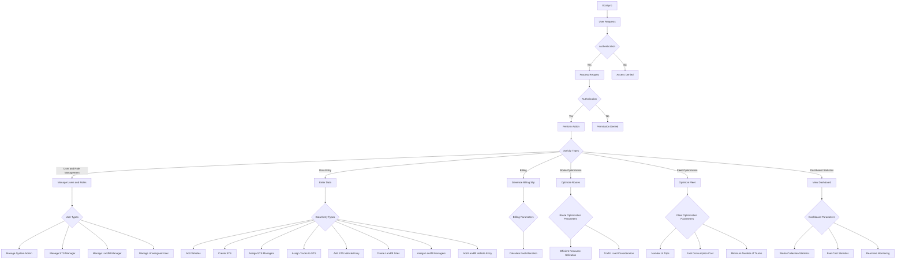
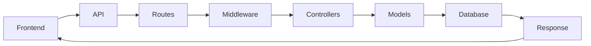

# EcoSync - Waste Management Application

Welcome to EcoSync, a Waste Management Application designed for Dhaka city. This project utilizes React for the frontend and Node.js for the backend, both located in the same root directory.

## Installation

To run the backend, navigate to the `server` directory:

```bash
cd server
npm install
npm start
# or
npm run dev
```

To run the frontend, navigate to the `client` directory:

```bash
cd client
npm install
npm run dev
```


## Database Management

To clean the database, run:

```bash
npm run clean:database
```

To seed the database, run:

```bash
npm run seed:database
```

## Environment Variables

Make sure to set up your `.env` file with the following variables:

```
MONGODB_URI=*your mongodb uri*
PORT=5000
JWT_SECRET=*your jwt secret
TOKEN_SECRET=*your token secret*
EMAIL=*your email*
PASSWORD=*your password*
```

## System admin Email & Password
Email : `admin@gmail.com`
Password : `password`

## About

EcoSync aims to streamline waste management processes in Dhaka city. It provides functionalities for efficient waste collection, tracking, and management.

For any inquiries, please contact team Endeavor at `teamendeavorcodesamurai@gmail.com`.


<!-- graph TD;
    <!-- A[Start] --> B[User Requests];
    B --> C{Authentication};
    C -- Yes --> D[Process Request];
    C -- No --> E[Access Denied];
    D --> F{Authorization};
    F -- Yes --> G[Perform Action];
    F -- No --> H[Permission Denied];
    G --> I[Generate Response];
    H --> I;
    E --> I[Generate Error Response];
    I --> J[End]; -->

    <!-- EcoSync: Revolutionizing Waste Management in Dhaka North
City Corporation
In the bustling city of Dhaka, the Dhaka North City Corporation (DNCC) has
been grappling with the ever-growing challenges of solid waste
management. The stakes are high in a city that is not just the heart of
Bangladesh's economic activities but also home to millions of dreams.
Amidst this, a visionary team at the DNCC has embarked on a mission to
redefine the city's approach to waste management. From the inefficiencies
in domestic waste collection to the pioneering initiatives with international
partners for waste-to-energy conversions, DNCC has taken multi-pronged
initiatives to improve the situation.
Current Municipal Solid Waste Management Practices:
● Domestic Waste Collection: Domestic wastes are collected from
housing societies and transported to one of 54 Secondary Transfer
Stations (STS) owned by DNCC.
● Waste Transfer: Waste is then transported from STS to landfills using
dump trucks and compactor trucks, with compactor trucks having the
capacity to carry 5x more volume due to compression. Aminbazar
landfill serves Dhaka North City Corporation (DNCC), while Matuail
landfill caters to the Dhaka South City Corporation (DSCC).
● STS and Open Bins: Each ward has one STS. The wards that do not
have any STS utilize open bins. DNCC operations begin in the
post-STS stage.
● Resource Allocation: DNCC manages oil allocation based on vehicle
trips to ensure efficient operation.
With the vision to create a sustainable and efficient waste management
ecosystem, the DNCC is now poised to introduce EcoSync. This
comprehensive web application will serve as the nerve center for all waste
management activities within the jurisdiction of the Dhaka North City
Corporation. EcoSync aims to bridge the gaps, streamline processes, and
enhance accountability through technological innovation.
The Challenge:
Participants are invited to design and develop EcoSync, a web application
that functions as an administrative panel for various stakeholders involved
in the solid waste management process of DNCC. The application should
cater to the specific needs of the System Admin, Landfill Manager, and STS
Managers, providing a unified platform to manage the complexities of
waste collection, transportation, and processing efficiently.
Key Features:
1. User and role management:
User Roles: The system will have 4 major user roles as defined below:
○ System Admin - The system admin user must be created during
the application startup (if not already created). This should be
part of the database creation step. System Admin will have
access to restricted features such as creating new users,
creating roles, assigning roles to users, creating facilities, etc.
One or more system admin accounts can be created.
○ STS Manager - The user type will initially be created by a
system admin. Upon login, the users should be able to change
their passwords. STS Manager will be responsible for operating
functionalities that are related to managing the STS facilities.
Further augmenting can be done by creating one manager user
for each STS facility.
○ Landfill Manager - Similar to STS Manager role, a system admin
will create the landfill manager users. The Landfill manager
users will be responsible for operating functionalities that are
related to managing a landfill facility. Further augmenting can
be done by creating one manager for each landfill.
○ Unassigned - Default role. When a new user is created by the
system admin without specifying a role, that user will have an
unassigned user role.
Authentication Endpoints
● /auth/login - For user login.
● /auth/logout - For logging out users and terminating sessions.
● /auth/reset-password/initiate - For initiating the password reset
process.
● /auth/reset-password/confirm - For confirming password reset
with a token or code.
● /auth/change-password - For allowing users to change their
password after logging in.
Authentication Views
● Login View: Users should be able to see a page for sending
credentials, e.g. username, password, captcha, etc. Login
should be supported for all user types except for the
“unassigned”.
● Change Password View: A page should be presented when the
user initiates a change password process. This view should be
able to receive old password, new password, and a captcha.
The page should also support an expiry time of 5 minutes since
the initiation of the change password process.
● Logout Control: Once logged in, users should be able to see a
Logout button. A successful logout should kill the user session
and take the user back to the public welcome page.
User Management Endpoints
● /users - GET method for listing all users (System Admin
access).
● /users/{userId} - GET method for retrieving a specific user's
details.
● /users - POST method for creating a new user (System Admin
access).
● /users/{userId} - PUT method for updating a user's details
(restricted to own details or System Admin access).
● /users/{userId} - DELETE method for deleting a user (System
Admin access).
● /users/roles - GET method for listing all available roles.
● /users/{userId}/roles - PUT method for updating a user's roles
(System Admin access).
User Management Views
● User Create/Update View: System admin users will be able to
use this page to create a new user or update information for an
existing user. Admin users can assign or modify already
existing roles to the user being created or edited. If no role is
specified when creating or updating a user, “unassigned” should
be set.
● User List View: System admin users will be able to use this
page to list down all existing users, search and sort users
based on various fields, etc.
● Update and Delete User Controls: From the list page, the
system admin users will be able to initiate a user update or
delete process. Deletion process must present the user with a
confirmation warning dialog.
Role-Based Access Control (RBAC) Endpoints
● /rbac/roles - For defining and managing roles.
● /rbac/permissions - For defining and managing permissions.
● /rbac/roles/{roleId}/permissions - For assigning permissions to
a role.
Role Management Views
● Create Roles and Permissions - System admin users will be
able to create new roles and permission levels. After creating a
role, admin users can assign permissions to that role. For
simplicity, the roles and permissions can pre-exist in Database
from initial application startup. This view is optional.
Profile Management Endpoints
● /profile - GET method for retrieving the logged-in user's profile.
● /profile - PUT method for updating the logged-in user's profile.
Profile Management Views
● Profile View - Any logged in user will be able to view this page.
Users will be able to see various details about the user profile.
Users will be able to update some of the fields that are
permitted to update to the specific user.
● Role View - User will be able to see the roles assigned to
him/her and the permissions that are granted via the assigned
roles. This should be a read-only view.
2. Data Entry Views:
○ System admin can add vehicles (trucks) with these mandatory
attributes. You can store additional attributes as you feel
necessary.
■ Vehicle Registration Number
■ Type: Open Truck, Dump Truck, Compactor, Container
Carrier
■ Capacity: 3 ton, 5 ton, 7 ton.
■ Fuel cost per kilometer - fully loaded,
■ Fuel cost per kilometer - unloaded.
○ System admin can create STS with ward number, capacity in
Tonnes and GPS coordinates.
○ System admin can assign one or more STS managers for each
STS.
○ System admin can assign one or more trucks to each STS, A
truck can only be used by one STS. A single STS can have many
trucks.
○ STS managers can add entry of vehicles leaving the STS with
STS ID, vehicle number, weight of waste, time of arrival and time
of departure.
○ System admin can create Landfill sites, with capacity,
operational timespan, GPS coordinates, etc.
○ System admin can assign one or more Landfill Managers for
each Landfill site.
○ Landfill managers can add entry of truck dumping with weight
of waste, time of arrival and time of departure.
3. Billing View: Landfill Manager can generate a slip at the end of each
transport from STS to the landfill. The slip will contain the
timestamps, weight of waste, truck details, and a fuel allocation
stamp. The program must calculate the fuel allocation based on
automated handling of weight bill data for accountability. Consider
the following constraints and formulas:
○ A vehicle goes to the landfill from STS at most three times every
day.
○ If the vehicle takes less volume than capacity, he’ll get a lower
fuel bill.
○ We assume the cost scales linearly between the unloaded and
fully loaded states. This is a broad assumption and might not
reflect reality perfectly, but it gives a basis for estimation.
Calculate the cost per kilometer based on load: Interpolate the
fuel cost per kilometer based on the actual load relative to the
truck's capacity.
If C_unloaded is the cost per kilometer unloaded, and C_loaded
is the cost per kilometer fully loaded (at 5 tons), and the truck is
loaded with 3 tons, the cost per kilometer for the journey could
be approximated as:
○ Download Slip: Additional option to export/download the slip in
a PDF format.
4. Route Optimization View: The STS manager can view and select
optimized routes from his or her STS to the designated Landfill site.
Following parameters can be taken into consideration:
○ Efficient use of resources, such as trucks, based on fuel
consumption cost.
○ Traffic load and congestion during the transfer. The routes and
times should be selected that leads to a time with less traffic
congestion to ensure quickest waste delivery to landfill.
○ You can use Google Map or any other map API for this section.
5. Fleet Optimization View: The STS manager can generate the fleet of
trucks he or she needs to deploy for the day to ensure fastest waste
transfer from STS to landfill site. A number of trucks with varying load
capacity are attached to each landfill. The system should assist
finding the required number of trucks to transfer maximum possible
waste from the STS to the Landfill. The following parameters can be
taken into consideration:
○ Each truck can have at most 3 trips.
○ Trucks should be chosen to first ensure minimum fuel
consumption cost, second to ensure minimum number of
trucks.
○ The distance from STS to Landfill should be considered
constant as the paths are pre-selected.
6. Dashboard Statistics View: Real-time monitoring of waste collection
and transportation activities, waste collection statistics at each STS
and Landfill site, Daily fuel cost statistics for the trucks, etc.
In read world, this process can involve automatic input from IOT
sensors, and a wide range of manual input. But for this problem, we
are following a simpler approach. The data can be manually input by
the STS and Landfill managers periodically. Reports are to be
generated based on the available data at any given time. -->


  tasklist
    2. End to End Activity Diagram 5 
 -->


 
## 1. Diagrams and Flowcharts
### Entity Relationship Diagram


### 2. End to End Activity Diagram



### 3. Backend Flow Diagram
 ```mermaid
graph LR;
    Frontend_API --> Routes;
    Routes --> Middleware;
    Middleware --> Controllers;
    Controllers --> Models;
    Models --> Database;
    Database --> Response;
    Response --> Frontend_API;
```
```sh
                                    +-------------------------+                                 
                                    |       Frontend/API      |                                 
                                    +-------------------------+                                 
                                                |                                               
                                                |                                               
                                    +-------------------------+                                 
                                    |         Routes          |                                 
                                    +-------------------------+                                 
                                                |                                               
                                                |                                               
                                    +-------------------------+                                 
                                    |      Middleware         |                                 
                                    |     (isAuthenticated)   |                                 
                                    +-------------------------+                                 
                                                |                                               
                    +----------------------------------------------------+                       
                    |                           |                        |                       
                    v                           v                        v                       
      +-------------------------+  +--------------------------+  +-------------------------+   
      |      Controllers        |  |        Models            |  |       Database          |   
      |     (e.g., Auth,        |  |     (e.g., User,         |  |                         |   
      |     User, Profile,      |  |      Vehicle, STS,       |  |                         |   
      |     RBAC, Vehicle,      |  |      LandfillEntry,      |  |     MongoDB Atlas       |   
      |     STS, Landfill,      |  |      Dashboard, Route)   |  |                         |   
      |     Dashboard)          |  |                          |  |                         |   
      +-------------------------+  +--------------------------+  +-------------------------+   
                                                |                                               
                                                |                                               
                                    +-------------------------+                                 
                                    |       Response          |                                 
                                    +-------------------------+                                 

```


### 4. Frontend Flow Diagram

